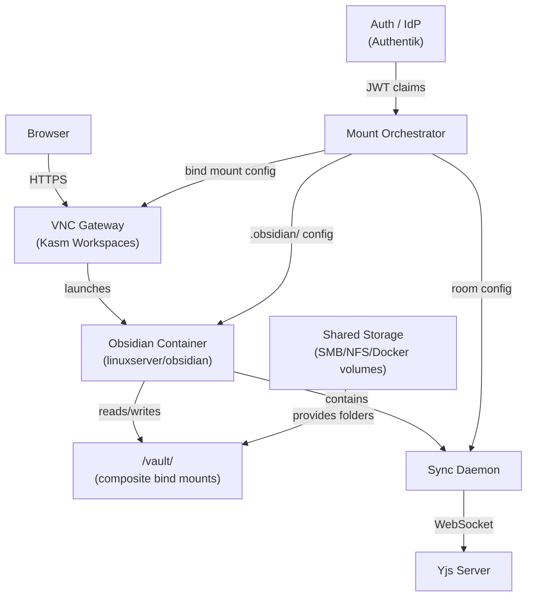

## System Diagram

## Layers

### Layer 1: VNC Gateway

Kasm Workspaces manages containerized Obsidian sessions. Each user gets their own container with a VNC stream to the browser. Kasm handles SSO, session lifecycle, and DLP controls.

### Layer 2: CRDT Sync

A Yjs-based sync system enables real-time collaboration. The sync daemon watches the filesystem for changes and propagates them via WebSocket to a central Yjs server. Each shared folder maps to a separate CRDT room, enabling per-folder sync granularity.

### Layer 3: Mount Orchestration

The mount orchestrator translates user identity (JWT claims + group membership) into Docker bind mounts. Each user's vault is a composite of only the folders they're authorized to access. This provides RBAC without file-level permission complexity.

## Deep Dive

For the full component catalog with comparison tables, tradeoffs, and alternative architectures, see the [Architecture Components](/obsidian-in-enterprise/knowledge-base/03-reference/architecture-components/) page in the Knowledge Base.
